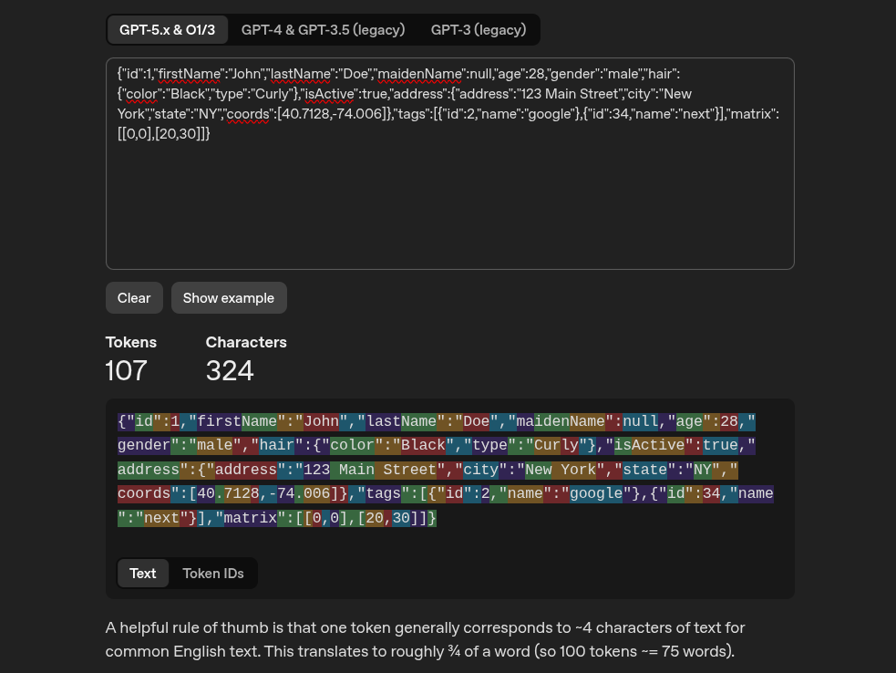
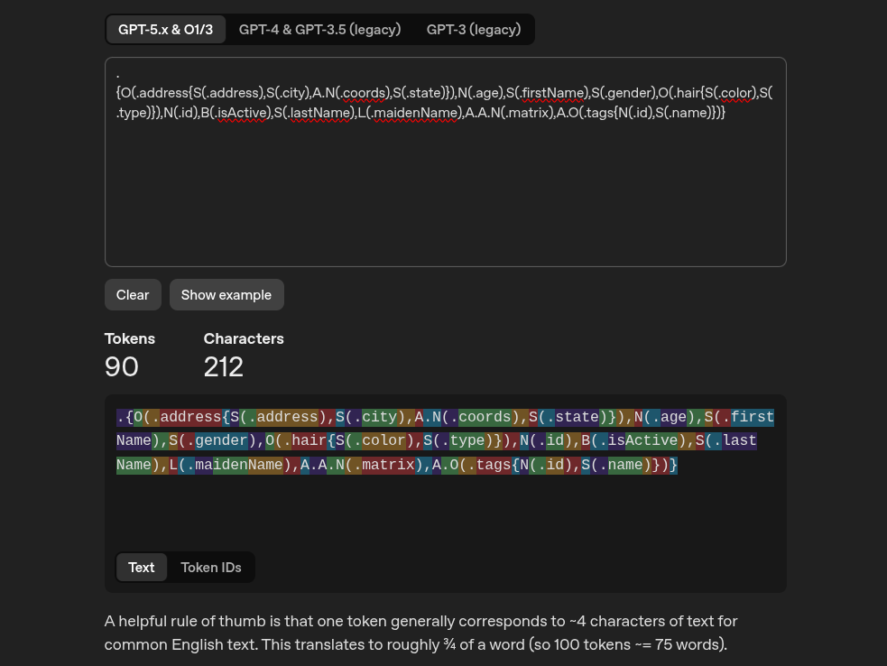

# RIN — Reduced Interface Notation

RIN is a compact schema notation with a TypeScript parser, runtime validator, and CLI tool designed for optimal token efficiency when prompting Large Language Models (LLMs) or defining structural schemas.

### Token Efficiency Comparison

Compare token count against standard JSON using the [OpenAI Tokenizer](https://platform.openai.com/tokenizer) (`GPT-5.x & O1/3` token estimator):

| Standard JSON (107 Tokens / 324 Chars) | RIN Schema (90 Tokens / 212 Chars) |
| :---: | :---: |
|  |  |

RIN reduces character count by **~35%** and token usage by **~16%** compared to standard verbose JSON structures, keeping schemas lightweight and precise.

## Quick Start

```ts
import { validate } from "./rin.ts";

const result = validate(
  ".{S(.name), N?(.age), A.O(.users?{S(.email)})}",
  { name: "Ada", age: null, users: [{ email: "ada@example.test" }] }
);

if (result.ok) {
  console.log("Valid payload:", result.value);
} else {
  console.error("Validation errors:", result.errors);
}
```

## Notation Reference

- **Root Containers**: `.{...}` (object root) or `.[...]` (array of records root).
- **Base Types**:
  - `S` — String
  - `N` — Number
  - `B` — Boolean
  - `L` — Null
  - `X` — Unknown / Any
  - `O` — Plain Object
- **Array Layer Modifier**: `A.` prefix adds an array dimension (e.g. `A.S` is `string[]`, `A.A.N` is `number[][]`).
- **Nullable Suffix**: `?` after a base type makes it nullable (e.g., `S?`, `A.N?`).
- **Optional Property**: `?` after a key identifier makes the property optional (e.g., `.age?`).
- **Unions**: `|` creates a type union (e.g., `N|S(.id)`).
- **Key Selectors & Record Bodies**: Properties are prefixed with `.` (e.g., `S(.name)`). Nested records use `{...}` syntax (e.g., `O(.profile{S(.name)})`).

*Note: Whitespace between tokens is ignored. Undeclared extra object properties are allowed by default during validation.*

## API Reference

### `parse(source: string): RootSchema`
Parses a raw RIN syntax string into a `RootSchema` AST structure. Throws a `RinSyntaxError` with error details and character position if syntax is invalid.

### `validate<T>(schema: RootSchema | string, value: T): ValidationResult<T>`
Validates an in-memory JS value against a RIN schema string or parsed AST.
Returns either `{ ok: true, value }` or `{ ok: false, errors: ValidationIssue[] }`.

## CLI Usage

The `rin` CLI automatically detects input format (JSON, RIN schema, or TypeScript `interface`) from `stdin` or a positional string argument.

```bash
# Convert JSON or interface from pipe to TypeScript types
curl -s https://example.test/data.json | bun cli.ts --to=type > types.ts

# Convert JSON to canonical RIN schema
bun cli.ts < response.json > schema.rin

# Convert RIN to JSON representation
printf '.{S(.name)}' | bun cli.ts --to-json

# Save output directly to file
bun cli.ts payload.json -o schema.rin
```

### CLI Output Flags
- `-t <format>` / `--to=<format>`: Specify target output format (`json`, `rin`, or `type`). Default is `rin`.
- `-J` / `--to-json`: Shortcut for `--to=json`.
- `-R` / `--to-rin`: Shortcut for `--to=rin`.
- `-T` / `--to-type`: Shortcut for `--to=type`.
- `-o <file>` / `--output=<file>`: Output file path.

## Development

```bash
# Install dependencies
bun install

# Run unit and integration tests
bun test

# Typecheck TypeScript files
bun run typecheck
```
